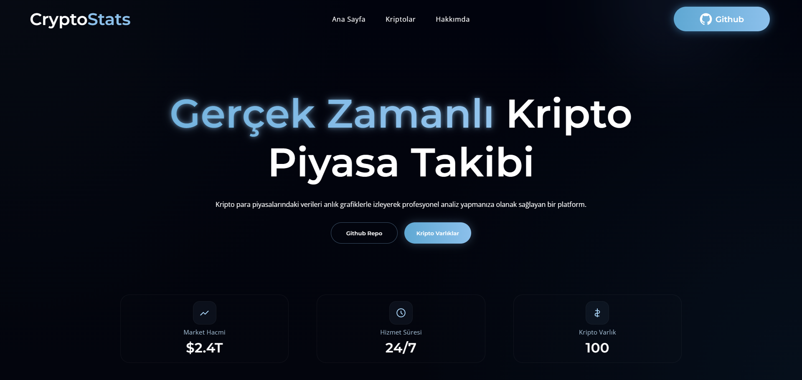
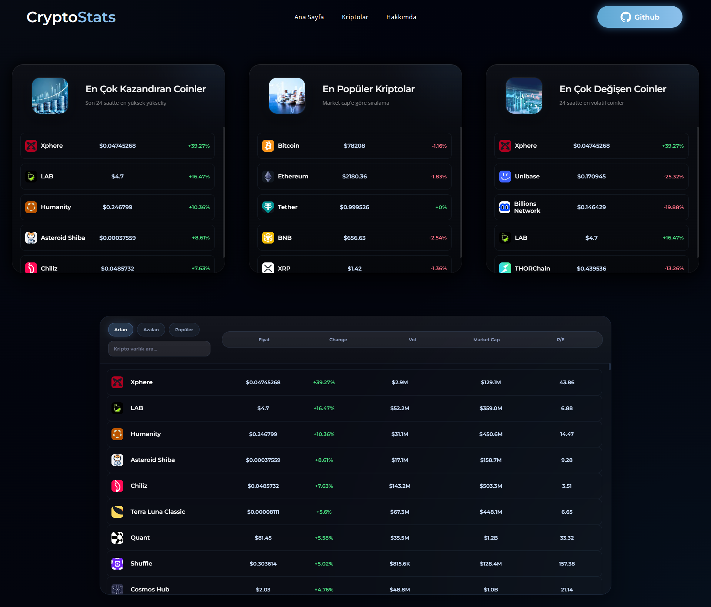
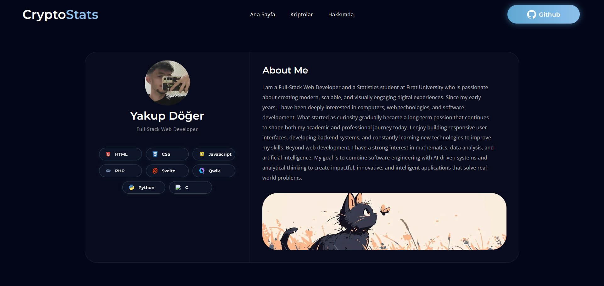
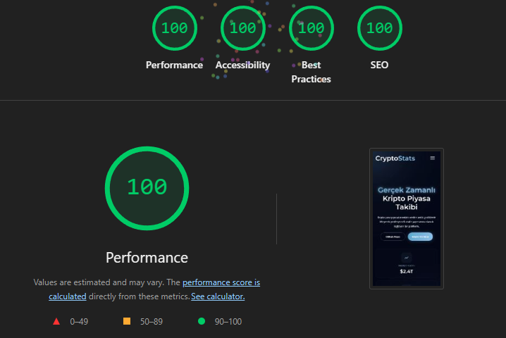
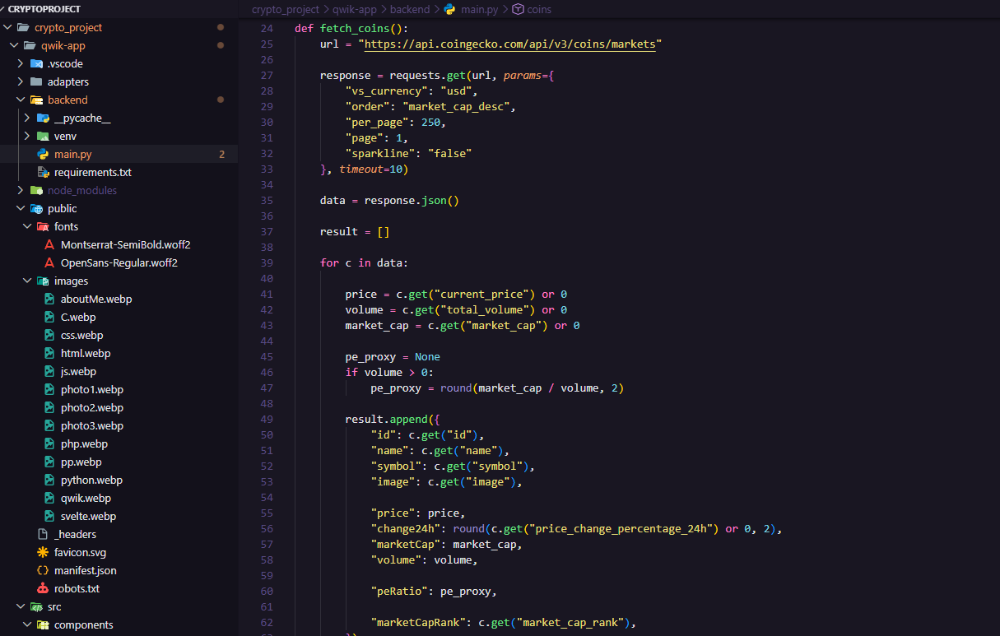
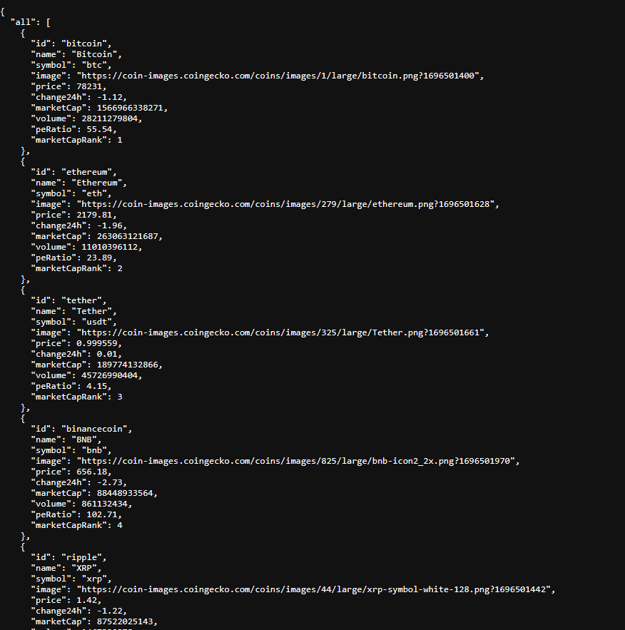

📊 Crypto Live Tracker (Qwik)

Canlı kripto verilerini güncel olarak çeken, onları işleyen ve web sitesinde gösteren bir uygulama geliştirdim.Bu uygulamayı algoritma proje ödevim için yaptım. Qwik kütüphanesi kullanmamda ki amaç resumability ve pre-load hızı aşırı iyi.
Başlangıçta tüm verileri yüklerken hiç sorun çıkartmıyor ve performans sorunlarını ortadan kaldırıyor.

Sitemden bazı görseller : 

Siteyi yaparken kullandığım Qwik kütüphanesi sayesinde performans olarak çok üst düzey bir başarı gerçekleştirebiliyor ( Kriptolar sayfasında performans kötü olabilir 1.000'e yakın veri çekiyorum api den). Google LightHouse Skor Testi : 

Verileri canlı olarak çekerken "CoinGecko" API'Sini kullandım. O api üzerinden fetch ile frontendden erişerek sitemde gösteriyorum.Qwik'de ki resumability sayesinde sadece gördüğün veriler load ediliyor. Python kodları : 

API'yi deploy ettiğim netlify üzerinden erişebilmek için railway ile internete açık yaptım o da bu şekilde :

